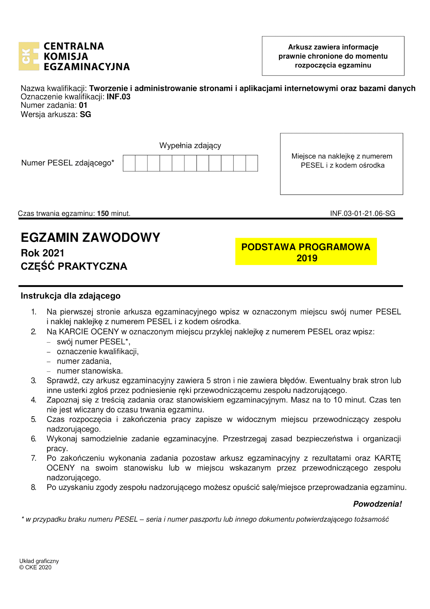
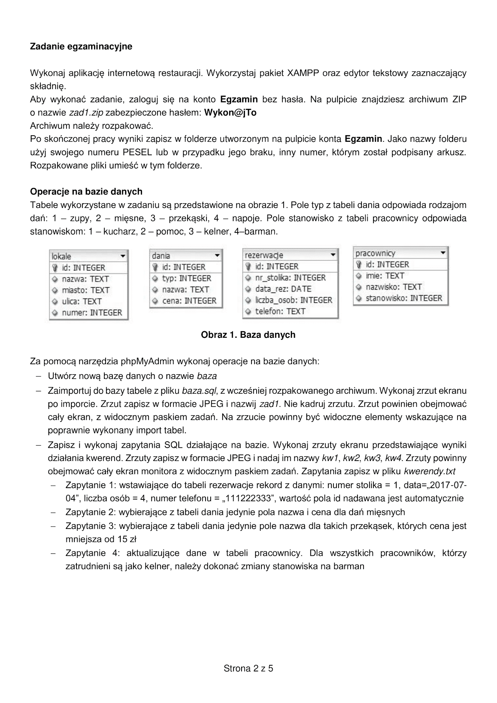
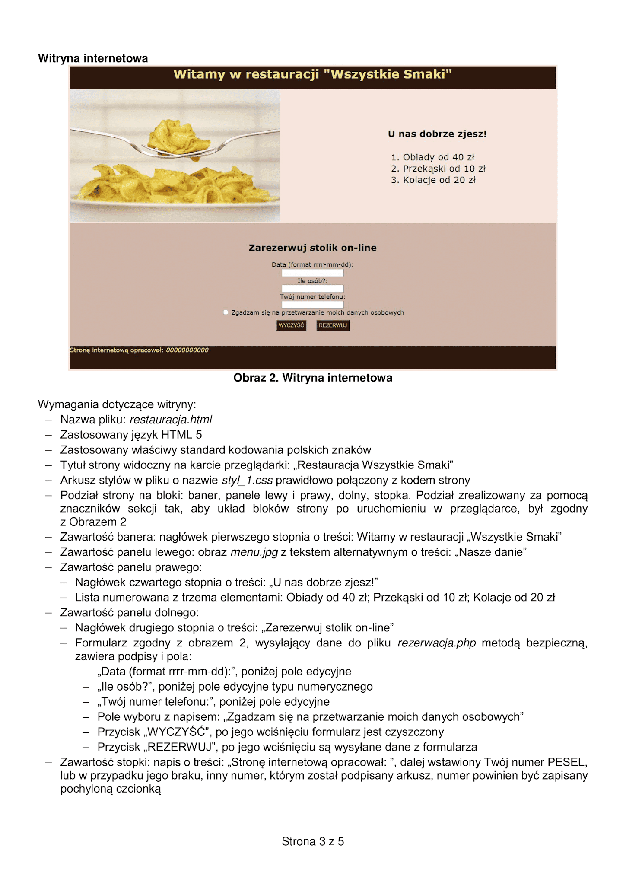
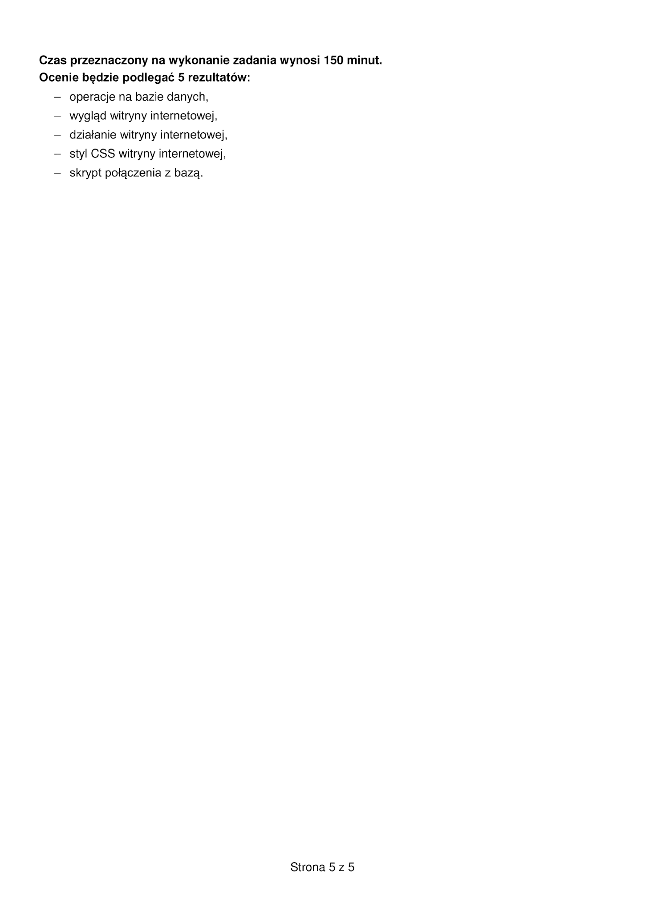

# Egzamin-zawodowy-INF.03-2021-06

## Streszczenie/Abstract

  
Polski

    Repozytorium przedstawia sposób roziazania państwowego egzaminu zawodowego z czerwcza 2021 z kwalifikacji zawodowej INF.03 - Tworzenie i administrowanie stronami i aplikacjami internetowymi oraz bazami danych.  

  
English

    The repository presents the method of terminating the state vocational examination of June 2021 on the professional qualification INF.03 - Creation and administration of websites, internet applications and databases.  
    Next instructions provided in Polish language.

 

## Polecenie

