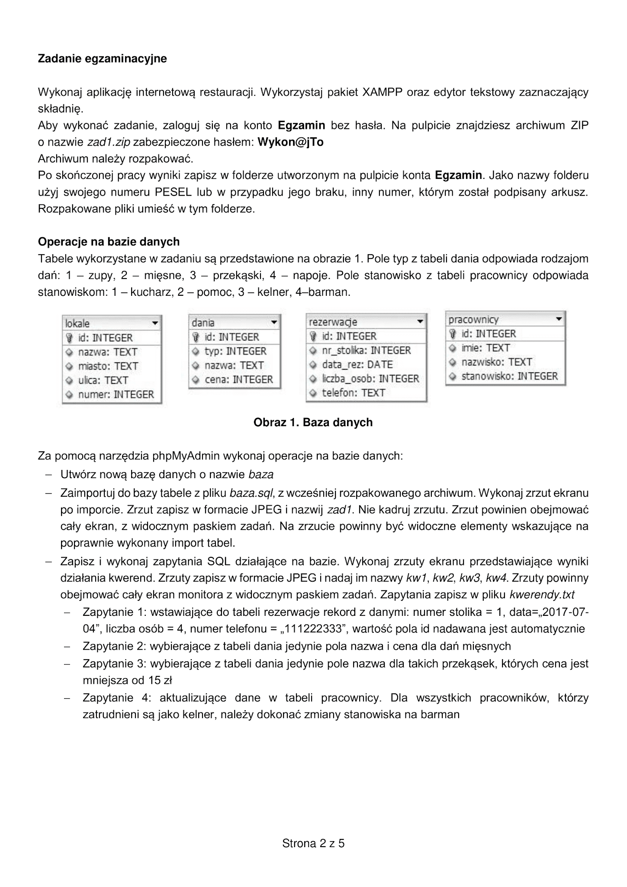
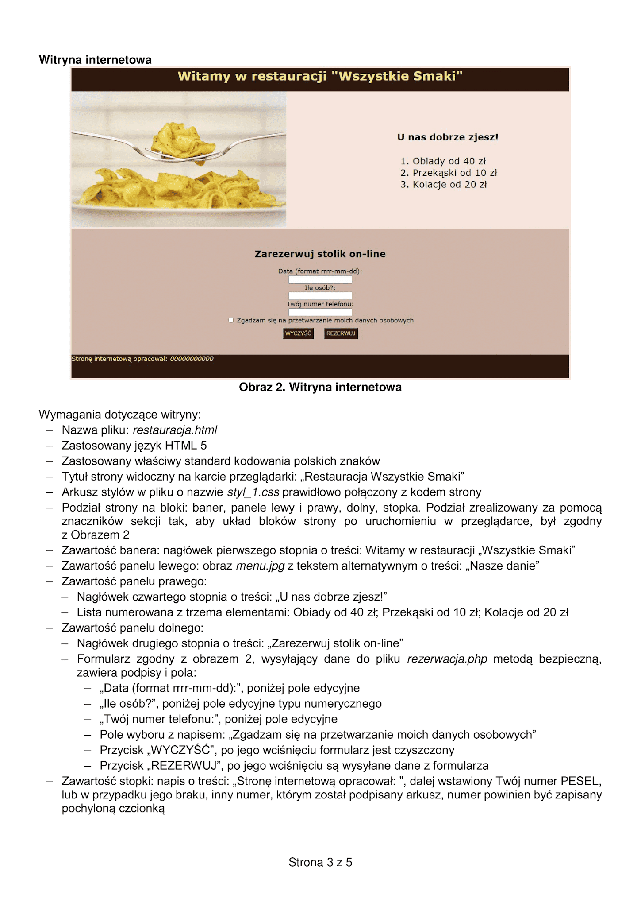
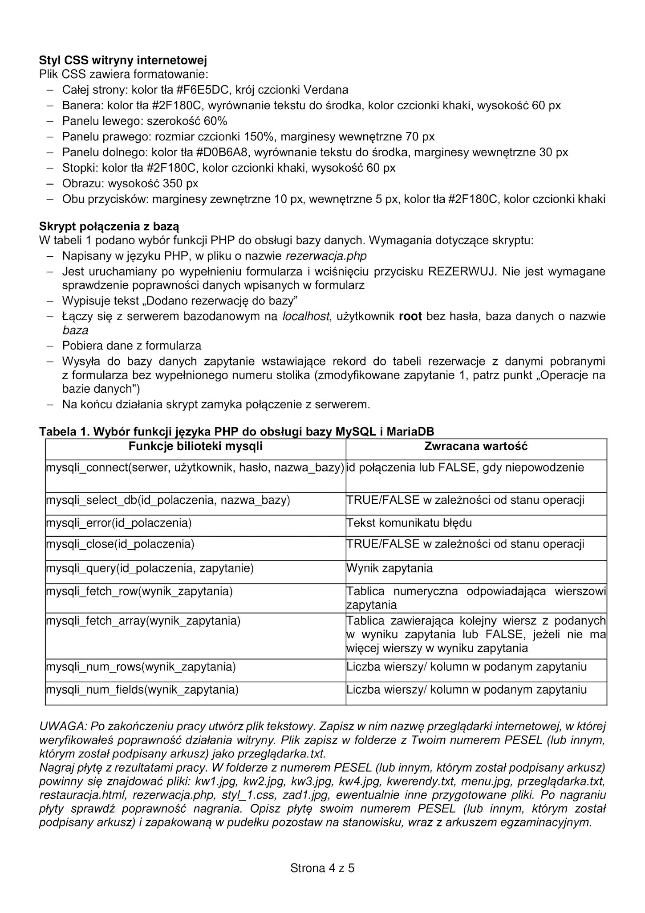
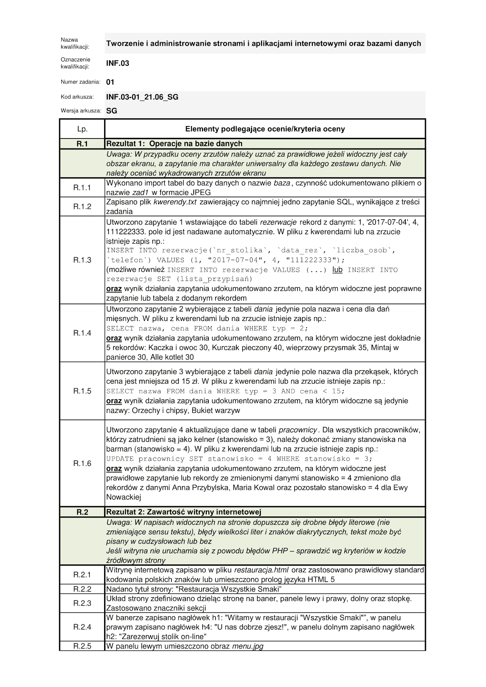
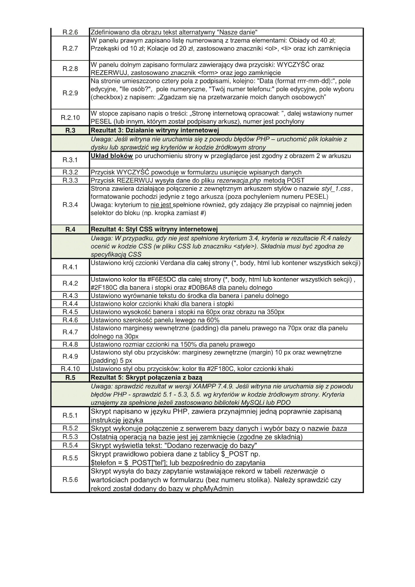

# Egzamin zawodowy - INF.03 2021.06

## Abstract

The repository presents the method of terminating the state vocational examination of June 2021 on the professional qualification INF.03 - Creation and administration of websites, internet applications and databases.  
Next instructions provided in Polish language.

Screenshots can be found in the [phpmyadmin](phpmyadmin) folder.

*The data in my database may differ from the answer keys as I did not have access to the original exam file.*

## Streszczenie

Repozytorium przedstawia sposób roziazania państwowego egzaminu zawodowego z czerwcza 2021 z kwalifikacji zawodowej INF.03 - Tworzenie i administrowanie stronami i aplikacjami internetowymi oraz bazami danych.

Zrzuty ekranu znajdują sie w folderze [phpmyadmin](phpmyadmin).

*Dane w mojej bazie danych mogą róznić się od podawanych w kluczy odpowiedzi z racji tego, że nie miałem dostepu do oryginalnego pliku z egzaminu.*

 

  
Polecenia

     

[Źródło](https://egzamin-inf03.blogspot.com/2021/09/arkusz-inf03-01-2106-sg.html)

  
Kryteria oceniania

     

[Źródło](https://egzamin-inf03.blogspot.com/2021/09/zasady-oceniania-inf03-01-2106-sg.html)

 

[Źródło powyzszego egzaminu](https://egzamin-inf03.blogspot.com/)
